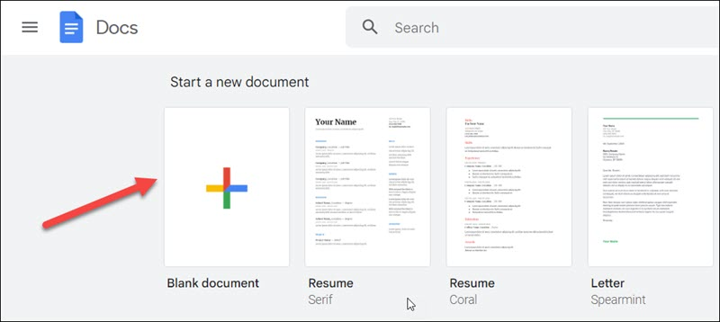

# Create a document
With Google Docs, you can easily create and modify documents.

To create a new document using Google Docs, do the following:

1. On your computer, go to [docs.google.com](https://docs.google.com/document/u/0/) to open the **Docs home** page.
2. Under **Start a new document**, select **Blank document** to create a new document.  
     

Alternatively, you can create documents in Google Drive.

To create a new document using Google Drive, do the following:

1. On your computer, go to [drive.google.com](https://drive.google.com/drive/).  
2. Click **New** > **Google Docs** > **Blank document** to create a new document.  
    

   The document is created.