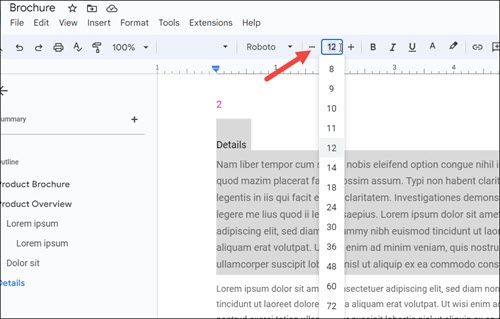

# Format the text
Clear and effective text formatting is crucial for emphasis, clarity, and structure. Google Docs offers various text styling options to help you achieve these objectives.
## Change the font
To change the font of the text in Google Docs, do the following:

1. Select the text you want to change.  
2. On the toolbar, click the font name to open the font list.  
      
3. Select the font you want.      
   
    !!! tip "Tip"

        To add more fonts to Google Docs, click **More fonts**. This opens the **Fonts** dialog where you can select new fonts.

The text is displayed in the selected font.

## Change the font size

To change the font size of the text in Google Docs, do the following:

1. Select the text you want to change.
2. On the toolbar, click the font size to open the font size list.
    A dropdown menu of font sizes appears.  
      
3. Select the font size you want to use.  
   
The selected text is changed to the new font size.

## Make text bold, italic, or underline

 To make the text in Google Docs bold, italic, or underline, do the following:

1. Select the text you want to change.
2. Format the text:
    - To bold, click **Bold** .
    - To italic, click **Italic** .
    -  To underline, click **Underline** .
  
  
The selected text is formatted.

## Highlight color

To highlight the text in Google Docs, do the following:  

1. Select the text you want to change.
2. On the toolbar, click **Highlight color** .
3. Select the color you want.  

The background color of the selected text is changed.

