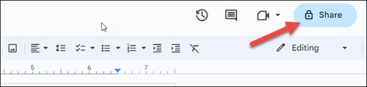
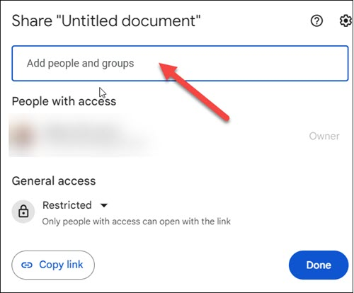
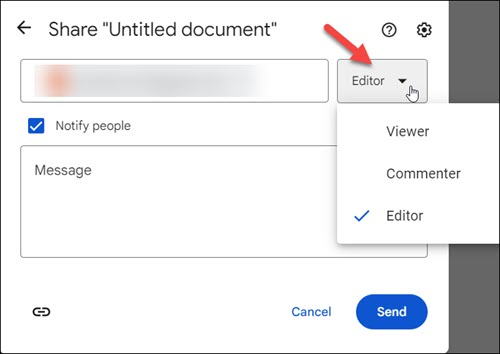
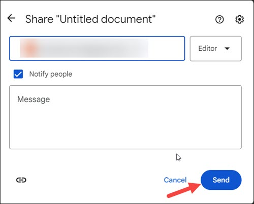
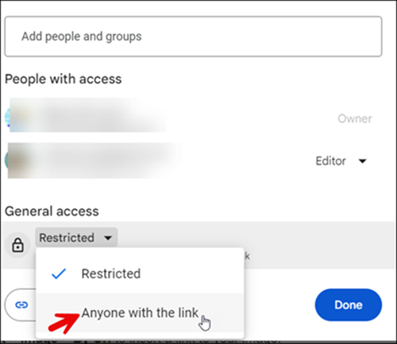
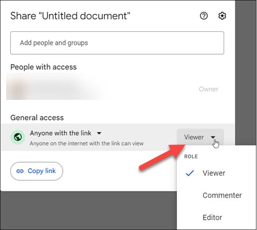
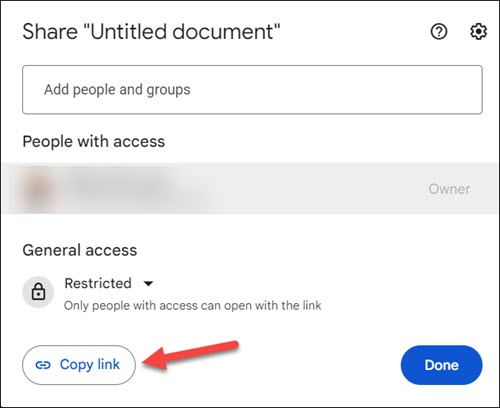
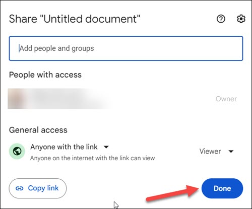

# Manage access
Google Docs is an excellent tool for document sharing and collaboration. With Google Docs, you can assign different levels of access based on each collaborator's role. This feature ensures that everyone involved in the project has access to the appropriate information.

To manage access to a document, do the following:

1. On your computer, go to [Google Docs](https://docs.google.com/document/u/0/).
2. Select the document you want to share.
3. Click the **Share** button to choose who to share with.  
     

4. In the text field, enter the email address of a person you want to share the document with.  
      

   
    !!! tip "Tip"

        If the person you are sharing the document with is already in your contacts, you have the option to choose the recipient from the list of suggested recipients.

5. In the dropdown menu, select **Viewer**, **Commenter**, or **Editor** to determine the level of access to your document.  
    

6. Click **Send**.  
    

You can also allow access to your document by sharing a link to the document.

To share a link to a document, do the following:

1. Select the document you want to share.
2. Click the **Share** button to choose who to share with.  
    
3. Click the arrow next to **Restricted** under **General access**, and then click **Anyone with the link** to choose who can access the document.  
      
4. In the dropdown menu, select **Viewer**, **Commenter**, or **Editor** to determine the level of access to your document.  
      
5. Click **Copy link** to share the link with whomever you want. You can send a link in emails or text messages.  
    
6. Click **Done**.  
       
   
The access to your document is allowed.