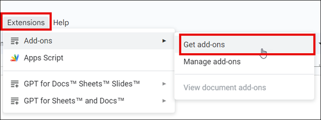
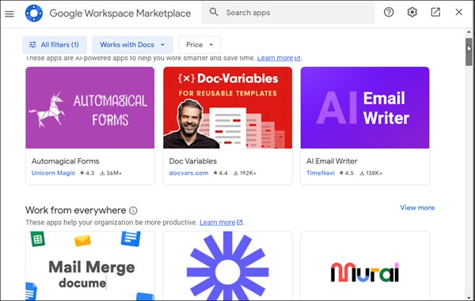
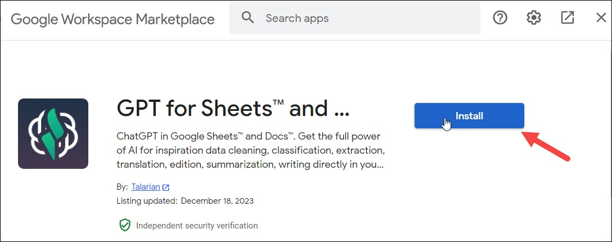
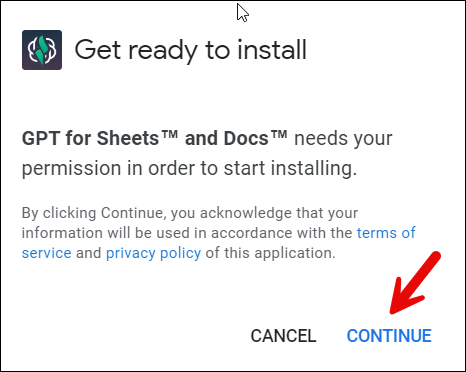
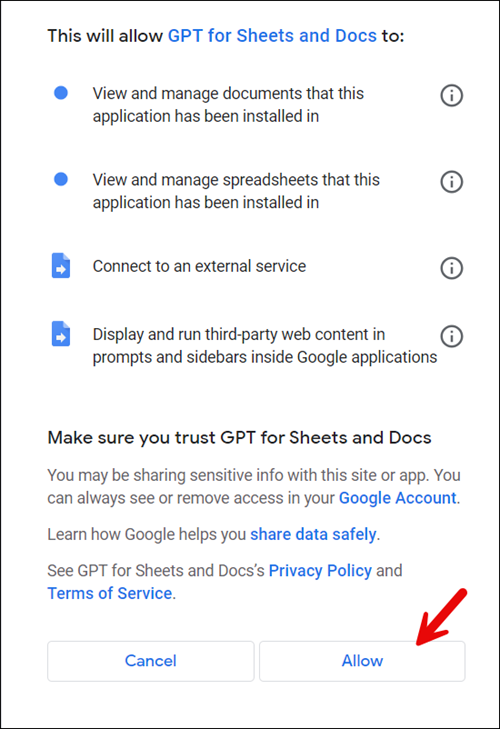
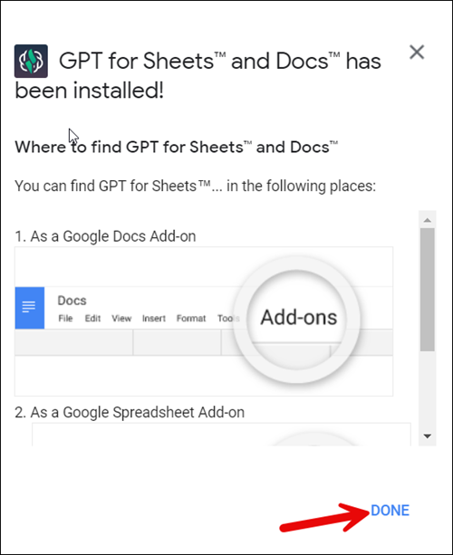
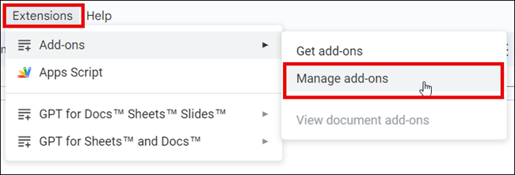
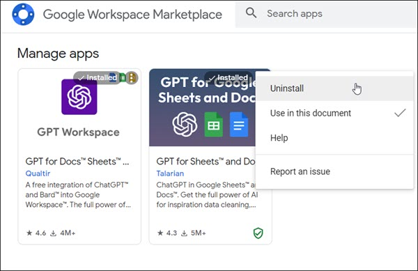

# Manage add-ons
Add-ons are customized applications that integrate with Google Workspace applications. With add-ons, you can easily insert special text, translate content, and add bibliographies. Google Docs has a vast collection of add-ons available.
## Install add-ons
To install an add-on, do the following:

1. On your computer, open a document in [Google Docs](https://docs.google.com/document/u/0/).
1. On the toolbar, click **Extensions** > **Add-ons** > **Get add-ons** to open **Google Workspace Marketplace** dialog.  
       
2.  Under **Google Workspace Marketplace**, click the add-on, to learn more about it.    
       
3. Click **Install** to install the add-on, and then choose an account.  
       

4. Click **Continue** to continue installation.  
     

5. Click **Allow** to allow access to data that the add-on needs to work.  
       

6. Once the add-on has been installed, click **Done**.  
       

The add-on is installed successfully.

## Uninstall add-ons
To uninstall an add-on, do the following:

1. On your computer, open a document in [Google Docs](https://docs.google.com/document/u/0/).
2. Click **Extensions** > **Add-ons** > **Manage add-ons**.  
       

3. Next to the add-on, click **Options** > **Uninstall**.  
       
   
The add-on is uninstalled.

   