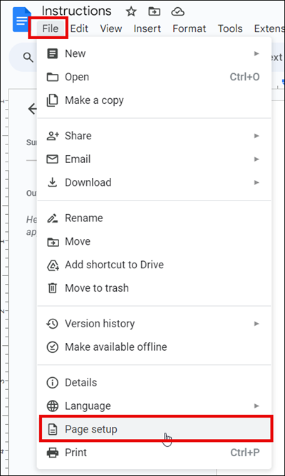
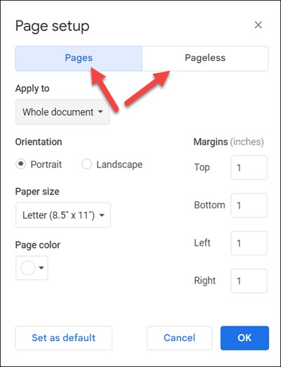
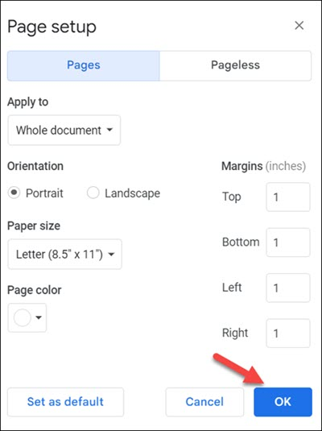

# Manage settings
With Google Docs, you can customize the page size, margins, orientation, and background color of your document.

To change page setup of a document, do the following:  

1. On your computer, open a document in [Google Docs](https://docs.google.com/document/u/0/).

2. Click **File** > **Page setup** to open the **Page setup** dialog.  
     
3. Select **Pages** or **Pageless**.  
    
1. Select the settings you want to change.  

    !!! tip "Tip"

        If you are in **Pageless** format, you can update the background color.

2. Click **OK** to save changes made.  
      
   
   
    !!! tip "Tip"

        You can click **Set as default** to apply these settings to any new documents you create.

